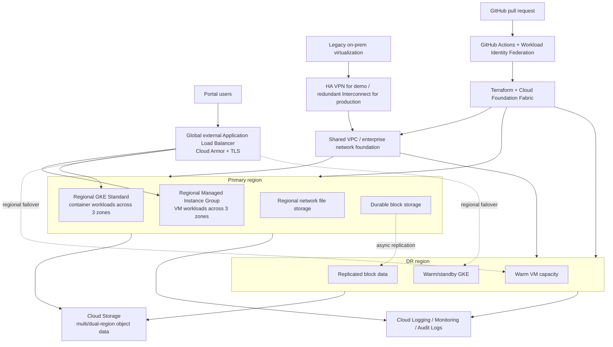

# Medicare Portal GCP Modernization Architecture

## Goal

Modernize a capacity-constrained on-premises virtualization environment while supporting both VM and container workloads, zone separation, mixed storage, geographic resilience, sub-15-minute recovery objectives for mission-critical VM applications, and automated/auditable deployments.

## Target architecture

## Requirement mapping

| Requirement | Recommendation |
|---|---|
| Existing VM applications | Compute Engine regional managed instance groups where possible; standalone/stateful VMs only where application architecture requires them |
| Container applications | Regional GKE Standard with multi-zone node pools |
| Zone separation | Regional MIG and regional GKE spread across three zones |
| Local storage | Local SSD only for scratch/cache/transient data |
| Network storage | Regional Filestore or another managed file pattern based on protocol/performance needs |
| Object storage | Cloud Storage, with dual/multi-region selection based on residency/RPO needs |
| RTO < 15 minutes | Pre-created warm DR infrastructure plus replicated data and a tested failover runbook |
| Geographic redundancy | Primary and DR regions with independent subnets/compute and replicated state |
| Automated deployment | Terraform using Cloud Foundation Fabric modules |
| Auditable deployment | Git pull requests, Actions run history, WIF identity, Terraform state, Cloud Audit Logs |

## Important RTO/RPO distinction

Backups alone do **not** satisfy an application RTO under 15 minutes. The mission-critical design requires:

1. secondary-region networking already deployed;
2. warm compute capacity or rapidly startable pre-created instance templates;
3. cross-region block/application/database replication;
4. health/failover decision logic;
5. an exercised runbook with measured recovery times.

Backup and DR remains necessary for corruption, accidental deletion, ransomware recovery, and longer-term restore points, but it is a separate recovery layer from the fast regional failover path.

## What the inexpensive demo deploys

The default Terraform variables deploy:

- one VPC with primary and DR regional subnets;
- a **primary regional VM MIG** spread across three zones with health check and autohealing;
- a **regional GKE Standard cluster** with a multi-zone node pool;
- a versioned **US Cloud Storage bucket** with soft delete;
- GitHub Actions/WIF automation.

The following are available but disabled by default to control cost:

- warm DR VM MIG (`enable_dr=true`);
- Local SSD scratch disks (`enable_local_ssd=true`);
- Enterprise/Regional network file storage (`enable_filestore=true`).

## Production hardening beyond the demo

The public VM NICs and public GKE access in this lab are deliberately optimized for demonstration simplicity. A production implementation should move to private workload networking and add, as applicable:

- global external Application Load Balancer and Cloud Armor;
- private GKE nodes and controlled Cloud NAT/Private Google Access;
- Shared VPC service projects;
- hierarchical firewall policies;
- organization policies;
- centralized KMS/CMEK where required;
- Secret Manager;
- VPC Service Controls for supported sensitive-data services;
- centralized audit/security logging;
- Security Command Center;
- production-grade Interconnect topology;
- explicit data replication and DR orchestration.

## Why Cloud Foundation Fabric

This demo uses Cloud Foundation Fabric rather than raw resources for the core cloud patterns because Fabric exposes lean, composable modules that map closely to underlying GCP constructs. The demo uses the `net-vpc`, `compute-vm`, `compute-mig`, `gke-cluster-standard`, `gke-nodepool`, and `gcs` modules pinned to release `v58.0.0`.

For a full enterprise deployment, the workload pattern sits on top of the Fabric FAST landing zone with organization setup, security, networking, VPC Service Controls as required, and project factories.
